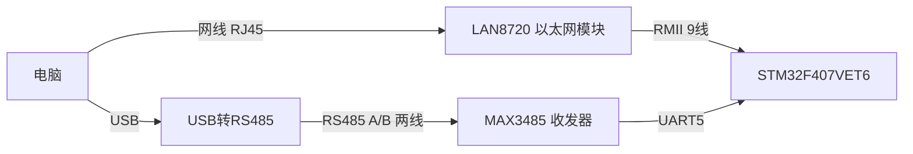

# 硬件接线与引脚说明

## 1. 系统连接总览

- **上行（Modbus TCP）**：电脑通过网线直连 LAN8720 模块的 RJ45 网口 → LAN8720 以 RMII 接口接到 STM32F407 的 ETH 外设 → MCU 运行 Modbus TCP 从站（端口 502）。
- **下行（Modbus RTU）**：STM32F407 的 UART5 连接 MAX3485（RS485 收发器）→ 通过 A/B 两根差分线接 USB 转 RS485 → 电脑。MCU 作为 Modbus RTU 主站轮询 RS485 总线上的从机。

> 调试时电脑上可用 MThings 同时打开两个连接：
> Modbus TCP（访问网关 502 端口）+ Modbus RTU（经 USB 转 RS485 访问下行从机）。

## 2. 引脚分配表

### 2.1 以太网（ETH / RMII，接 LAN8720）

| STM32 引脚 | 信号 | 说明 |
| --- | --- | --- |
| PA1 | ETH_REF_CLK | RMII 50 MHz 参考时钟（由 LAN8720 模块提供） |
| PA2 | ETH_MDIO | 管理接口数据 |
| PC1 | ETH_MDC | 管理接口时钟 |
| PA7 | ETH_CRS_DV | 载波侦听/数据有效 |
| PC4 | ETH_RXD0 | 接收数据位 0 |
| PC5 | ETH_RXD1 | 接收数据位 1 |
| PB11 | ETH_TX_EN | 发送使能 |
| PB12 | ETH_TXD0 | 发送数据位 0 |
| PB13 | ETH_TXD1 | 发送数据位 1 |

> 注意：本工程的 TX 引脚用的是 **PB11/PB12/PB13**（部分参考设计用 PG11/PG13/PG14），请按实际板子走线核对。

### 2.2 RS485 下行总线（UART5 + MAX3485）

| STM32 引脚 | 外设信号 | 接到 MAX3485 |
| --- | --- | --- |
| PC12 | UART5_TX | DI（发送数据输入） |
| PD2 | UART5_RX | RO（接收数据输出） |
| PD1 | GPIO 输出（方向控制） | DE + RE（收发使能，低有效收发） |

- 波特率：**9600，8 数据位，无校验，1 停止位**（`usart.c` 中 UART5 配置）
- MAX3485 的 A/B 差分线 → USB 转 RS485 的 A/B 对应连接
- PD1 为输出推挽，低电平 = 接收态 / 高电平 = 发送态（`gpio.c` 初始化为 RESET）

### 2.3 调试串口（USART1）

| STM32 引脚 | 外设信号 | 说明 |
| --- | --- | --- |
| PA9 | USART1_TX | 调试日志输出（115200） |
| PA10 | USART1_RX | 调试输入（预留） |

> 轮询任务启动、从机上下线、读取结果等日志均通过 USART1 打印，波特率 115200。

## 3. 关键配置速查

| 项目 | 配置 |
| --- | --- |
| 主控 | STM32F407VET6（LQFP100） |
| 以太网 | HAL_ETH_RMII_MODE，LAN8742 PHY，TCP 端口 502 |
| 下行总线 | UART5 @ 9600 8N1，半双工，PD1 方向控制 |
| 调试口 | USART1 @ 115200 8N1 |
| 看门狗 | IWDG（LSI 32 kHz 内部 RC） |

> 完整的引脚/时钟/外设配置以 CubeMX 工程 `modbus.ioc` 为准。
